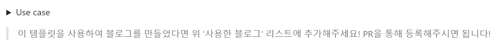
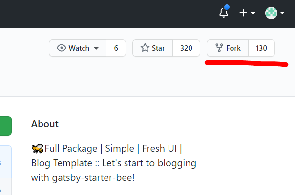
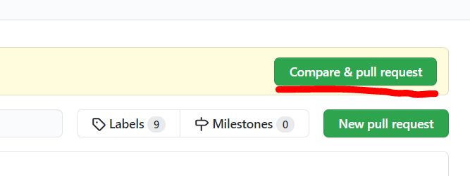
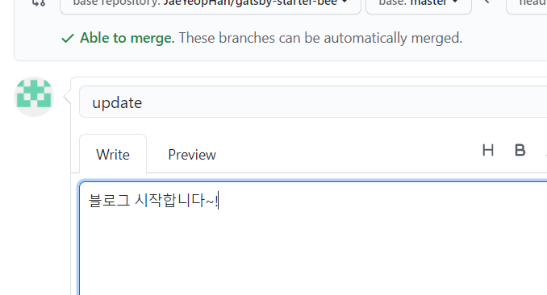
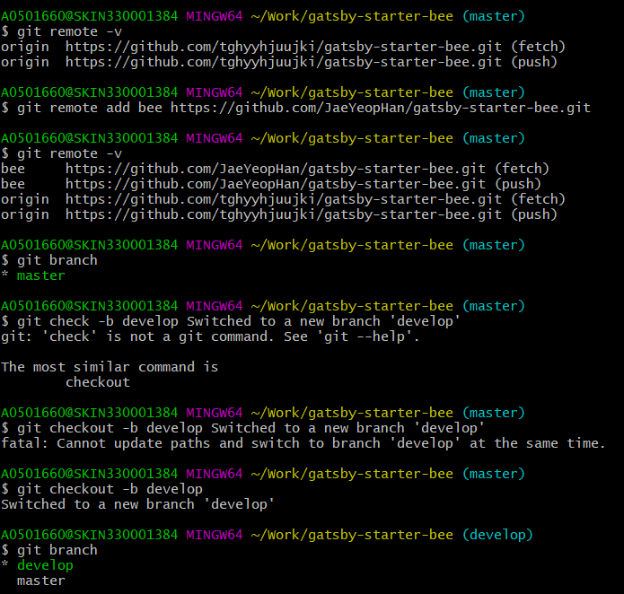

Github PR 해주세요~

PR해주세요가 뭘까..?

Gatsby로 Blog를 만들면서 [한재엽님의 오픈소스](https://github.com/JaeYeopHan/gatsby-starter-bee)를 활용하기로 했다.

블로그를 만드는 도중 Readme 파일을 봤는데, 다음과 같이 써 있었다.



PR이 뭐지? 하고 찾다가, Pull Request라는 것을 알게 되었고, [이 글을](https://wayhome25.github.io/git/2017/07/08/git-first-pull-request-story/) 를 참고하여 해결하였다.

과정은 다음과 같다.

### 1. Fork

내가 소스로 활용할 상대의 Repository를 내 Repository 복사해 새롭게 생성하는 것이라 보면 된다. 

상대의 Repository 왼쪽 상단에 `Fork` 를 눌러 가지 칠 준비를 해준다. 130은 fork 한 사람들의 수!



<br/>

Fork에 성공하면 내 아이디도 Fork 리스트에 들어가 있는 것을 볼 수 있다.


### 2. 로컬에 저장소 만들기

평소 기계적으로 다음 명령어를 사용해 나의 Git을 관리했었다.

```sh
$ git add .
$ git commit -m "update"
$ git push origin master
```

하지만 남의 Repository master에 push하는 권한이 보통은 없기 때문에 








